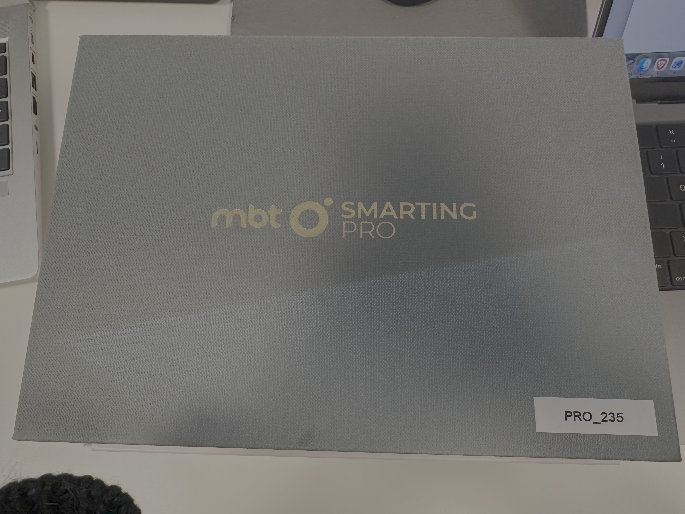
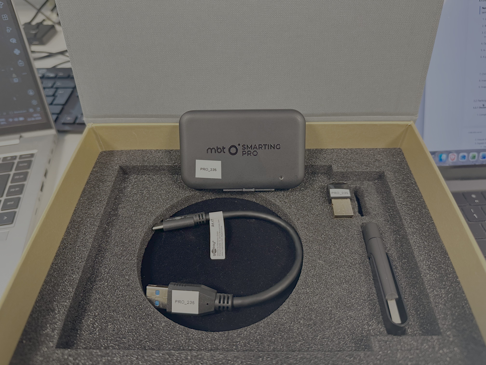
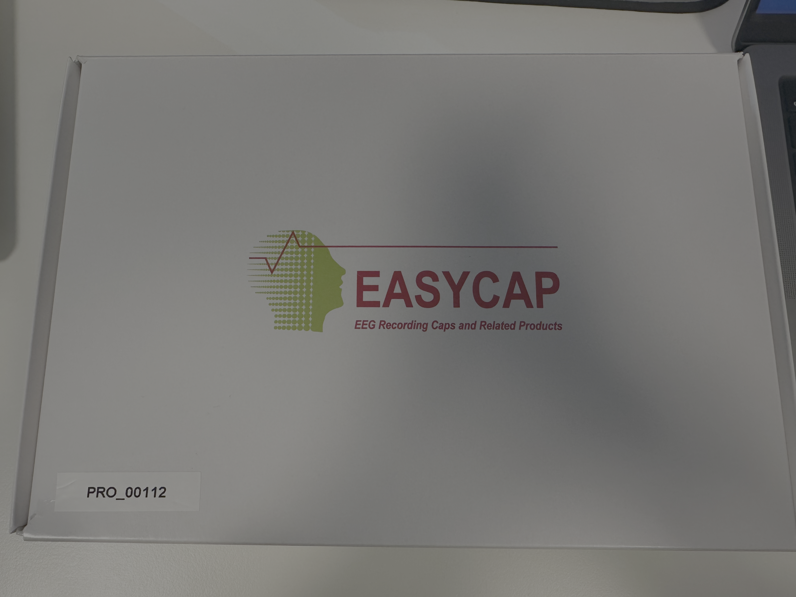
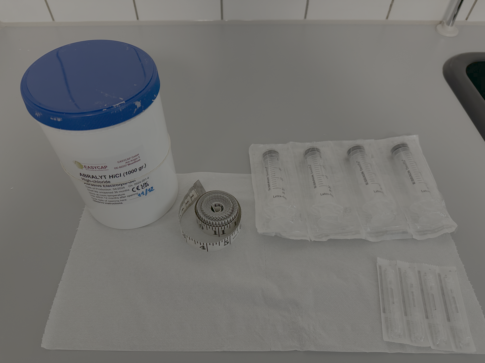
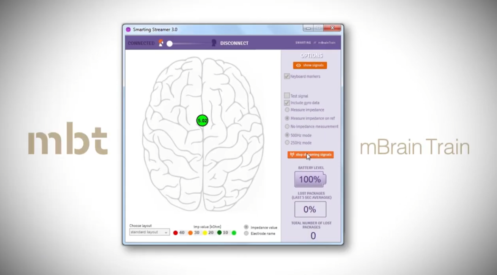
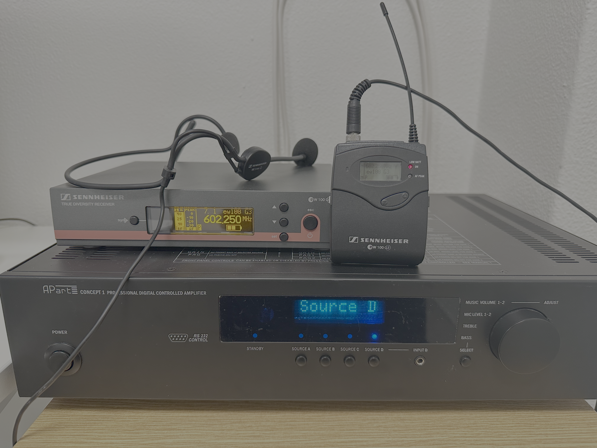
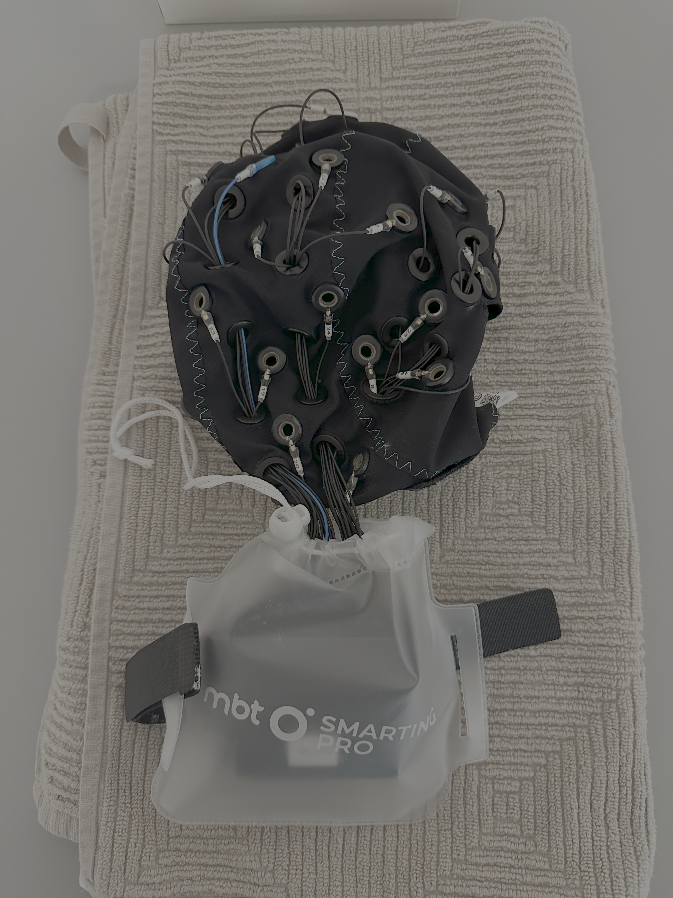

# COBE EEG Laboratory
## User Manual

**Version 1.0**  
**Last Updated: July 2026**

This is a user manual for how to use our mBrainTrain EEG system and our EEG lab.

COBE Lab has two mBrainTrain wireless Smarting Pro amplifiers, that allow the recording of neurophysiological EEG activity as 
measured by a set of electrodes placed on the scalp. The amplifiers come with 32 channel recording caps and mBrainTrain's 
recording software, Smarting Pro Streamer. The amplifiers are wireless making them suitable for data collection both inside and 
outside of the lab. COBE Lab has a dedicated space, lab 1E, for EEG studies with a control room and two testing rooms.
The control room features four screens connected to four computers in an anteroom, a speaker system and video stream of both testing rooms.

## Table of Contents

1. [Equipment Access Policy](#1-equipment-access-policy)
2. [Equipment Inventory](#2-equipment-inventory)
3. [Standard Operating Procedures](#3-standard-operating-procedures)
4. [Equipment Maintenance](#4-equipment-maintenance)
5. [Troubleshooting](#5-troubleshooting)
6. [Data management in COBE Lab](#6-data-management)

---

## 1. Equipment Access Policy

### 1.1 General Requirements

All users must complete the following before using EEG equipment:

- Submit a COBE Lab [pre-study form](https://bss.au.dk/fileadmin/BSS/Forskning/centre/cognitionbehaiviourlab/Forms_and_checklists/COBE_PSF_120325.pdf) for approval by the Lab Manager and LICS representative 
- Be registered in the equipment usage log (name and specific equipment used)
- Read this User Manual 
- Submit a signed [acknowledgment form](#appendix-b-training-acknowledgement-form) confirming completion of training (above requirements + any additional steps listed in 1.2)

### 1.2 User Categories & Requirements

**Principal Investigators (PIs)**

- Complete general requirements listed in 1.1
- No additional steps required

**Postdoctoral Researchers**

- Complete general requirements in 1.1
- Obtain PI signature on [acknowledgment form](#appendix-b-training-acknowledgement-form) confirming awareness of equipment use

**PhD Students**

- Both PI and student must complete requirements listed above 
- Both must sign [acknowledgment form](#appendix-b-training-acknowledgement-form)

**Bachelor's/Master's Students**

- Both PI and student must complete general requirements in 1.1
- Both must sign [acknowledgment form](#appendix-b-training-acknowledgement-form)
- **Must complete at least 1 supervised pilot session with PI before collecting participant data**

### 1.3 Equipment & Room booking

All users must book both the room and the specific equipment that they plan to use. Users are accomodated on a first-come-first-serve basis. This is the general COBE Lab Policy, which you can find here: https://bss.au.dk/en/cognition-and-behavior-lab.

---

## 2. Equipment Inventory

All EEG equipment is stored in cabinet #5 in the EEG lab control room. 

> *Indicates item that have not yet been ordered. 

> **Note:** Please notify the Lab Manager if any consumables are running  low or equipment needs maintenance. 

### 2.1 EEG System 01
- **Amplifier (ID: PRO_234)**
- **Charging USB cable** (1)
- **Software USB dongle** (1)
- **Bluetooth USB dongle** (1)

### 2.2 EEG System 02
- **Amplifier: (ID: PRO_235)**
- **Charging USB cable** (1)
- **Software USB dongle** (1)
- **Bluetooth USB dongle** (1)

### 2.3 EEG Caps and Accessories
- 32-channel 56cm caps (2 caps: PRO_00116, PRO_00112)
- 32-channel 54cm cap*
- 32-channel 58cm cap*
- Electrode cleaning brushes (2 bags x 25 brushes / bag)
- Plastic wash-bags (2)
- Conductive gel (2 bottles: check expiration dates before use)

### 2.4 Additional Items for Data Collection
- Biohazard waste disposal bucket for syringe tips (1)
- Measuring tape (1)
- Towel (1)
- Hairdryer (1)
- Shampoo (1)

  <figure style="margin: 0; display: inline-block;">
    
    <figcaption style="font-style: bold; font-size: 0.9em; margin-top: 8px; color: #FFF;">
      Figure 1: Example EEG kit box outside (for System #2, PRO_235), can be found in Cabinet #5.
    </figcaption>
  </figure>

  <figure style="margin: 0; display: inline-block;">
    
    <figcaption style="font-style: bold; font-size: 0.9em; margin-top: 8px; color: #FFF;">
      Figure 2: EEG kit contents (featuring amplifer PRO_235, Bluetooth USB dongle, USB-C to USB-A charging cable, and USB stick with mBrainTrain resources)
    </figcaption>
  </figure>

  <figure style="margin: 0; display: inline-block;">
    
    <figcaption style="font-style: bold; font-size: 0.9em; margin-top: 8px; color: #FFF;">
      Figure 3: Example EEG cap box for EasyCap caps, also found in Cabinet #5. 
    </figcaption>
  </figure>

### 2.5 Timing Test Equipment
- Latency testing box for testing synchronization of auditory and visual stimuli with EEG (2)*

---

## 3. Standard Operating Procedures

### 3.1 Pre-Session Setup

#### 3.1.0 Check charge on amplifier(s)

1. Take desired amplifier out of EEG kit
2. Plug in USB dongle in EEG kit to EEG recording computer
3. Elevate user privileges by enabling Heimdal software:
    - Click on bottom panel > lower right arrow icon > blue and white icon 
    - Click on Privileges & Apps Control 
    - Click Request admin privileges
4. Start MBT software on recording computer
5. Click toggle next to "Disconnected" to Connect
6. Choose device from drop-down menu (if it does not appear, click Scan, then select device)
7. Press "Stream"
8. Battery level is indicated in the upper left corner
9. If charged, no need to do more. If not charged, see charging instructions at bottom of manual. 

  <a href="https://youtu.be/vnpgimI0PW8)">
    Watch video of how to open mbt software
  </a>

#### 3.1.1 Prepare Documentation

Ensure the following forms are ready:

- EEG Information Sheet
- Participant Information Sheet
- Consent Form
- [Head measurement log](#appendix-a-head-measurement-log) 

#### 3.1.2 Prepare Gelling Station

1. Place 1 bottle of gel on a convenient surface
2. Fill 4 syringes with gel:
   - Minimize air bubbles during filling
   - Test each syringe by pushing out excess gel that may come out with force
3. Prepare a bundle of paper towels
4. Have measuring tape ready 

  <figure style="margin: 0; display: inline-block;">
    
    <figcaption style="font-style: bold; font-size: 0.9em; margin-top: 8px; color: #FFF;">
      Figure 4: Materials to be prepared in advance of participant arrival. These materials should be found on the prep table in lab. 
    </figcaption>
  </figure>

#### 3.1.3 EEG System Setup
> **Note**: Please only use the amplifier(s) assigned to your experiment in the usage log (should be same for every recording session in your experiment)

1. Locate the amplifier kit for your experiment (labelled by ID)
2. Remove the amplifier and locate the Bluetooth dongle (smallest dongle in kit)
3. Connect the Bluetooth dongle to the EEG recording computer (all computers have the software installed, so choose one), either in PC rack or USB extension 
4. Elevate user privileges by enabling Heimdal software:
    - Click on bottom panel > lower right arrow icon > blue and white icon 
    - Click on Privileges & Apps Control 
    - Click Request admin privileges
5. Open the mBrainTrain (MBT) Streamer software from the EEG recording computer Desktop
    - If the software prompts you for a username and password, find both inside cabinet #5
6. In the MBT software, click the toggle next to 'Disconnected' (see the upper left window)
7. A pop-up window will appear:
   - If no devices are listed, click 'Scan'
   - If devices are listed, select the amplifier associated with your experiment (PRO_234 or PRO_235)
8. Click 'Connect'
9. Insert the amplifier into the cap's amplifier holder so that the pins are connected 
10. Snap the amplifier holder into the the cap so that it is secure

  <a href="https://youtube.com/shorts/osUlLfFy6xo?feature=share">
    Watch video of how to insert amplifier into cap
  </a>

    
### 3.2 Participant Arrival and Cap Fitting

#### 3.2.1 Documentation and Orientation

1. Complete all required forms with the participant
2. Ensure the participant reads the EEG Information Sheet which you can find in the lab
3. Explain the process:
   - Head measurement procedure
   - Gel application process
   - What they will experience during the session

#### 3.2.2 Head Measurement

**Initial Measurement:**

1. Measure head circumference by wrapping the tape measure around the head at the level of the forehead center
2. Record measurement in the [head measurement log](#appendix-a-head-measurement-log) (this is for your records)
3. Select the correctly sized cap (we have 2 56cm, 1 58*, 54*)

**Cap Placement:**

You can find the brochure on cap measurement in the lab to help with the steps below.

1. Place the cap on the participant's head
   - Hold the cap from the inside to avoid touching electrodes
   - Ensure the cap fabric lies flat (not bunched) on the head
   - If needed, you may remove the amplifier from the socket to locate the inion

**Electrode Positioning Verification:**

Verify that electrode Cz (electrode #18) is centered between the following anatomical landmarks:

- **Nasion-to-Inion:**
  - Place the 0cm point of the tape measure at the nasion (dip between eyebrows at the nose bridge)
  - Measure to the inion (bony ridge at the back of the head, underneath the hair)
  - Record this distance in the [head measurement log](#appendix-a-head-measurement-log)

- **Pre-Auricular Points (Left-to-Right):**
  - Locate the gap between the upper and lower jaw next to each ear
  - Measure the distance between left and right pre-auricular points
  - Record this distance in the [head measurement log](#appendix-a-head-measurement-log) 
  

### 3.3 Gel Application and Impedance Check

#### 3.3.1 Initial Setup

1. Turn on the recording software and navigate to the **Settings** tab
2. Select the **CapMounting** setting
3. Click **Streaming** in the recording software

#### 3.3.2 Reference and Ground Electrodes

**Fill the following electrodes first:**

- Ground electrode (white, labeled DLR)
- Reference electrode (blue, labeled CMS)
- One additional electrode

**Proper gel application technique:**

1. Gently move hair aside with the applicator
2. Apply gel
3. Move the applicator in a circular motion on the scalp

**Monitor impedance:**

- Continuously adjust gel in REF/GND electrodes until impedance drops below 10kΩ (light green indicator)

  <figure style="margin: 0; display: inline-block;">
    
    <figcaption style="font-style: bold; font-size: 0.9em; margin-top: 8px; color: #FFF;">
      Figure 5: Screenshot of software displaying impedance on reference. 
    </figcaption>
  </figure>

#### 3.3.3 All Electrodes

1. Once the three initial electrodes are complete, stop streaming
2. Navigate to setting tab. Under **Impedance Measurement**, change to **All Electrodes**
3. Restart streaming
4. Apply gel to all remaining electrodes
   - **Optimal:** Light green (≤10kΩ)
   - **Acceptable:** Dark green (≤20kΩ)
   - Note: This process may take considerable time

  <figure style="margin: 0; display: inline-block;">
    
    <figcaption style="font-style: bold; font-size: 0.9em; margin-top: 8px; color: #FFF;">
      Figure 6: Example EEG cap box for EasyCap caps, also found in Cabinet #5. 
    </figcaption>
  </figure>

  <a href="https://youtu.be/NAlAlnSV24I">
    Watch video of how adjust settings for impedence measurement
  </a>

#### 3.3.4 Final Signal Check

1. Turn off impedance measurement and stop streaming
2. Start streaming again and navigate to the **Signals** tab
3. Verify data quality through the visualization
   - Note: Visualization shows processed data; raw data is what gets stored

**Important:** Avoid getting gel on surrounding surfaces during application

### 3.4 Data Collection

#### 3.4.1 Start EEG recording
1. Make sure that Streaming is set to "on"
2. Click red "Record" button
3. In pop-up window:
    - File format = "xdf file" or "bdf file" (both are easily readable by MATLAB & Python)
    - Folder = Path to your experiment folder
    - Name = You preferred name
    - Check all available LSL streams
    - Click PC recording (otherwise you will save to SD card on the amplifier, which we do not have a protocol for at the moment)
    - Open the Signals tab to monitor Signal + triggers
4. Start your experiment on the stimulus presentation machine 

  <a href="https://youtu.be/5oC-Jjeuayc">
    Watch video of how to make recording in mbt software
  </a>

#### 3.4.2 Communication System

- Use the speaker system (located to the right on the control room table) to give instructions to the participant
- Turn on all three components (open the microphone cover to activate it)
- **Turn off the speaker system once the experiment begins**

  <figure style="margin: 0; display: inline-block;">
    
    <figcaption style="font-style: bold; font-size: 0.9em; margin-top: 8px; color: #FFF;">
      Figure 4: Communication speaker system for giving instructions to participants. 
    </figcaption>
  </figure>

#### 3.4.3 Participant Monitoring

- Monitor the participant via the video stream on the laptop in the control room
- Ensure data quality remains stable throughout the session 

### 3.5 Post-Session Procedures

#### 3.5.1 Ending the Recording

1. Stop recording and disconnect the amplifier in the software
2. Remove the cap from the participant's head
3. Place the amplifier by the sink (still attached to the cap)
4. Escort the participant out and show them to the hair-washing station if needed

#### 3.5.3 Cap Cleaning Procedure

**Preparation:**

1. Wash your hands thoroughly (they likely have gel on them)
2. Disconnect the amplifier from the cap
3. Place the amplifier holder and as much of the cable as possible in the clear protective bag
4. Charge amplifier if needed (see instructions below)
5. Store amplifier in the appropriate kit

  <a href="https://youtube.com/shorts/z5UG28plQ80?feature=share">
    Watch video of how disconnect the amplifier from the cap
  </a>

**Cleaning:**

1. Clean the cap using the mascara-style brushes at the lab sink
2. Ensure all gel is removed from each electrode
3. Rinse thoroughly with water

  <a href="https://www.youtube.com/watch?v=pPvsxgS5FQ4">
    Watch official MBT cap cleaning tutorial video here
  </a>

**Drying and Storage:**

1. Place the clean cap on a towel by the sink to dry (keep amplifier holder in the protective bag so that it does not get wet)
2. Allow the cap to dry completely before storing
3. Once dry, store the cap in the appropriate kit

  <figure style="margin: 0; display: inline-block;">
    
    <figcaption style="font-style: bold; font-size: 0.9em; margin-top: 8px; color: #FFF;">
      Figure 7: Example of how to dry the EEG caps (on a towel, with the amplifer securely bundled in protective plastic bag). 
    </figcaption>
  </figure>

**Cleanup:**

1. Push excess gel back into the gel container
2. Clean syringes with water
3. Dispose of syringe tips in the biohazard waste bucket
4. Empty any lab trash into the hallway trashcans 

**Charge amplifiers:**

1. Find USB in EEG kit for your amplifier 
2. Plug USB-C into amplifier and USB-A into computer for charging
3. Charging can take several hours so be sure to leave enough time between participants to get a full charge. 
4. When the amplifier is done charging, a green light will appear
5. After charging, please return amplifier & USB charger to box with EEG kit 

A test of charging time from 30% to 100% took roughly 2,5 hours with a 20W charger.
A test of how quickly the battery gets drained showed that the amplifiers loose roughly 10% battery per hour. 

<table style="border-collapse: collapse; width: 100%; border: 1px solid black;">
  <thead>
    <tr style="background-color: #f2f2f2;">
      <th style="border: 1px solid black; padding: 8px; text-align: left;">Time of day</th>
      <th style="border: 1px solid black; padding: 8px; text-align: left;">Battery level</th>
    </tr>
  </thead>

  <tbody>
    <tr>
      <td style="border: 1px solid black; padding: 8px;">09.08</td>
      <td style="border: 1px solid black; padding: 8px;">95%</td>
    </tr>
    <tr>
      <td style="border: 1px solid black; padding: 8px;">10.37</td>
      <td style="border: 1px solid black; padding: 8px;">80%</td>
    </tr>
    <tr>
      <td style="border: 1px solid black; padding: 8px;">11.21</td>
      <td style="border: 1px solid black; padding: 8px;">72%</td>
    </tr>
    <tr>
      <td style="border: 1px solid black; padding: 8px;">12.29</td>
      <td style="border: 1px solid black; padding: 8px;">60%</td>
    </tr>
    <tr>
      <td style="border: 1px solid black; padding: 8px;">13.25</td>
      <td style="border: 1px solid black; padding: 8px;">50%</td>
    </tr>
    <tr>
      <td style="border: 1px solid black; padding: 8px;">14.25</td>
      <td style="border: 1px solid black; padding: 8px;">40%</td>
    </tr>
    <tr>
      <td style="border: 1px solid black; padding: 8px;">15.21</td>
      <td style="border: 1px solid black; padding: 8px;">30%</td>
    </tr>
  </tbody>
</table>

## 4. Equipment Maintenance

### 4.1 Consumables Management

**Monitor and maintain adequate supplies of:**

- Conductive gel (check expiration dates)
- Syringes and tips
- Electrode cleaning brushes
- Paper towels
- Shampoo and towels

**Reporting:**

- Notify the Lab Manager when supplies are running low (before completely depleted)
- Report any equipment malfunctions immediately
- Log any issues in the equipment log

### 4.2 Regular Maintenance Schedule

**After each use:**

- Clean cap thoroughly
- Inspect electrodes for damage
- Ensure amplifier is stored properly

**Weekly:**

- Check gel expiration dates
- Verify all equipment is accounted for
- Clean lab surfaces

**Monthly:**

- Deep clean all caps
- Inventory all supplies
- Report equipment status to Lab Manager

---

## 5. Troubleshooting

### 5.1 LSL Stream Not Visible

If you cannot see the LSL stream:

1. Go to **Start** and search for "allow an app through windows firewall"
2. Click **Change settings**
   - You may need to elevate privileges with Heimdal first
   - Enter the COBE Lab's username and password
3. Click **Allow another app**
   - For the sending computer: typically **Python**
   - For the receiving computer: typically ** MBTstreamer**
4. To find the app location:
   - Open PowerShell
   - Type `python list`
   - Copy the path into the pop-up window
5. Click **OK**

### 5.2 Bluetooth Connection Issues

**Before first use of a new Bluetooth dongle:**

1. Open **Device Manager**
2. Locate and disable the internal Bluetooth driver for the dongle
3. **Do this before plugging in the dongle for the first time**

### 5.3 High Impedance Troubleshooting

If an electrode consistently shows high impedance:

- Check that hair is moved aside sufficiently
- Add more gel
- Gently press and rotate the electrode against the scalp
- Ensure the electrode is making good scalp contact (not sitting on hair)

### 5.4 Poor Signal Quality

- Re-check impedance of all electrodes
- Verify reference and ground electrodes are well below 10kΩ
- Check that amplifier connections are secure
- Ensure participant is relaxed and minimizing muscle tension

## 6. Data management
Remember to transfer the data to your personal AU-computer and store it correctly. You should never store data on COBE Lab's computers due to risk of data theft and data breach. 
We routinely delete data stored on our equipment, so you are at risk of loosing your data, if you store them on our equipment.

---

## Contact Information

**Lab Manager:** cobelab@au.dk

**LICS Representative:** contact the Lab Manager to be directed to the LICS Representative

---

## Appendix A: Head Measurement Log

Use this log to track head measurements and cap sizes for each experimental session. This helps ensure consistency across sessions and aids in equipment planning.
Find a downloadable version on our [AU-website](https://bss.au.dk/en/cognition-and-behavior-lab/for-researchers/checklist-for-new-research-projects)

<table style="border-collapse: collapse; width: 100%; border: 1px solid black;">
  <thead>
    <tr style="background-color: #f2f2f2;">
      <th style="border: 1px solid black; padding: 8px; text-align: left;">Experiment Session #</th>
      <th style="border: 1px solid black; padding: 8px; text-align: left;">Date</th>
      <th style="border: 1px solid black; padding: 8px; text-align: left;">Head Measurement(s)</th>
      <th style="border: 1px solid black; padding: 8px; text-align: left;">Cap Size(s) Used</th>
    </tr>
  </thead>
  <tbody>
    <tr>
      <td style="border: 1px solid black; padding: 8px;">&nbsp;</td>
      <td style="border: 1px solid black; padding: 8px;">&nbsp;</td>
      <td style="border: 1px solid black; padding: 8px;">&nbsp;</td>
      <td style="border: 1px solid black; padding: 8px;">&nbsp;</td>
    </tr>
    <tr>
      <td style="border: 1px solid black; padding: 8px;">&nbsp;</td>
      <td style="border: 1px solid black; padding: 8px;">&nbsp;</td>
      <td style="border: 1px solid black; padding: 8px;">&nbsp;</td>
      <td style="border: 1px solid black; padding: 8px;">&nbsp;</td>
    </tr>
    <tr>
      <td style="border: 1px solid black; padding: 8px;">&nbsp;</td>
      <td style="border: 1px solid black; padding: 8px;">&nbsp;</td>
      <td style="border: 1px solid black; padding: 8px;">&nbsp;</td>
      <td style="border: 1px solid black; padding: 8px;">&nbsp;</td>
    </tr>
    <tr>
      <td style="border: 1px solid black; padding: 8px;">&nbsp;</td>
      <td style="border: 1px solid black; padding: 8px;">&nbsp;</td>
      <td style="border: 1px solid black; padding: 8px;">&nbsp;</td>
      <td style="border: 1px solid black; padding: 8px;">&nbsp;</td>
    </tr>
    <tr>
      <td style="border: 1px solid black; padding: 8px;">&nbsp;</td>
      <td style="border: 1px solid black; padding: 8px;">&nbsp;</td>
      <td style="border: 1px solid black; padding: 8px;">&nbsp;</td>
      <td style="border: 1px solid black; padding: 8px;">&nbsp;</td>
    </tr>
    <tr>
      <td style="border: 1px solid black; padding: 8px;">&nbsp;</td>
      <td style="border: 1px solid black; padding: 8px;">&nbsp;</td>
      <td style="border: 1px solid black; padding: 8px;">&nbsp;</td>
      <td style="border: 1px solid black; padding: 8px;">&nbsp;</td>
    </tr>
    <tr>
      <td style="border: 1px solid black; padding: 8px;">&nbsp;</td>
      <td style="border: 1px solid black; padding: 8px;">&nbsp;</td>
      <td style="border: 1px solid black; padding: 8px;">&nbsp;</td>
      <td style="border: 1px solid black; padding: 8px;">&nbsp;</td>
    </tr>
    <tr>
      <td style="border: 1px solid black; padding: 8px;">&nbsp;</td>
      <td style="border: 1px solid black; padding: 8px;">&nbsp;</td>
      <td style="border: 1px solid black; padding: 8px;">&nbsp;</td>
      <td style="border: 1px solid black; padding: 8px;">&nbsp;</td>
    </tr>
    <tr>
      <td style="border: 1px solid black; padding: 8px;">&nbsp;</td>
      <td style="border: 1px solid black; padding: 8px;">&nbsp;</td>
      <td style="border: 1px solid black; padding: 8px;">&nbsp;</td>
      <td style="border: 1px solid black; padding: 8px;">&nbsp;</td>
    </tr>
    <tr>
      <td style="border: 1px solid black; padding: 8px;">&nbsp;</td>
      <td style="border: 1px solid black; padding: 8px;">&nbsp;</td>
      <td style="border: 1px solid black; padding: 8px;">&nbsp;</td>
      <td style="border: 1px solid black; padding: 8px;">&nbsp;</td>
    </tr>
    <tr>
      <td style="border: 1px solid black; padding: 8px;">&nbsp;</td>
      <td style="border: 1px solid black; padding: 8px;">&nbsp;</td>
      <td style="border: 1px solid black; padding: 8px;">&nbsp;</td>
      <td style="border: 1px solid black; padding: 8px;">&nbsp;</td>
    </tr>
    <tr>
      <td style="border: 1px solid black; padding: 8px;">&nbsp;</td>
      <td style="border: 1px solid black; padding: 8px;">&nbsp;</td>
      <td style="border: 1px solid black; padding: 8px;">&nbsp;</td>
      <td style="border: 1px solid black; padding: 8px;">&nbsp;</td>
    </tr>
    <tr>
      <td style="border: 1px solid black; padding: 8px;">&nbsp;</td>
      <td style="border: 1px solid black; padding: 8px;">&nbsp;</td>
      <td style="border: 1px solid black; padding: 8px;">&nbsp;</td>
      <td style="border: 1px solid black; padding: 8px;">&nbsp;</td>
    </tr>
    <tr>
      <td style="border: 1px solid black; padding: 8px;">&nbsp;</td>
      <td style="border: 1px solid black; padding: 8px;">&nbsp;</td>
      <td style="border: 1px solid black; padding: 8px;">&nbsp;</td>
      <td style="border: 1px solid black; padding: 8px;">&nbsp;</td>
    </tr>
    <tr>
      <td style="border: 1px solid black; padding: 8px;">&nbsp;</td>
      <td style="border: 1px solid black; padding: 8px;">&nbsp;</td>
      <td style="border: 1px solid black; padding: 8px;">&nbsp;</td>
      <td style="border: 1px solid black; padding: 8px;">&nbsp;</td>
    </tr>
  </tbody>
</table>

**Instructions:**

- Record the session number or participant ID
- Enter the date in DD/MM/YYYY format
- Record head circumference in cm (e.g., 56cm, 54cm, 58cm)
- Note which cap(s) were used (e.g., PRO_00116, PRO_00112)

---

## Appendix B: Equipment Log
Use this log to track equipment usage and any comments/issues that arise during testing.
Find a downloadable version on our [AU-website](https://bss.au.dk/en/cognition-and-behavior-lab/for-researchers/checklist-for-new-research-projects)

<table style="border-collapse: collapse; width: 100%; border: 1px solid black;">
  <thead>
    <tr style="background-color: #f2f2f2;">
      <th style="border: 1px solid black; padding: 8px; text-align: left;">Experiment Session #</th>
      <th style="border: 1px solid black; padding: 8px; text-align: left;">Researcher(s)</th>
      <th style="border: 1px solid black; padding: 8px; text-align: left;">Study responsible</th>
      <th style="border: 1px solid black; padding: 8px; text-align: left;">Amplifiers used</th>
      <th style="border: 1px solid black; padding: 8px; text-align: left;">Caps used</th>
      <th style="border: 1px solid black; padding: 8px; text-align: left;">Timing test equipment used</th>
      <th style="border: 1px solid black; padding: 8px; text-align: left;">Comments</th>
    </tr>
  </thead>

  <tbody>
    <tr>
      <td style="border: 1px solid black; padding: 8px;">&nbsp;</td>
      <td style="border: 1px solid black; padding: 8px;">&nbsp;</td>
      <td style="border: 1px solid black; padding: 8px;">&nbsp;</td>
      <td style="border: 1px solid black; padding: 8px;">&nbsp;</td>
      <td style="border: 1px solid black; padding: 8px;">&nbsp;</td>
      <td style="border: 1px solid black; padding: 8px;">&nbsp;</td>
      <td style="border: 1px solid black; padding: 8px;">&nbsp;</td>
    </tr>

    <tr>
      <td style="border: 1px solid black; padding: 8px;">&nbsp;</td>
      <td style="border: 1px solid black; padding: 8px;">&nbsp;</td>
      <td style="border: 1px solid black; padding: 8px;">&nbsp;</td>
      <td style="border: 1px solid black; padding: 8px;">&nbsp;</td>
      <td style="border: 1px solid black; padding: 8px;">&nbsp;</td>
      <td style="border: 1px solid black; padding: 8px;">&nbsp;</td>
      <td style="border: 1px solid black; padding: 8px;">&nbsp;</td>
    </tr>

    <tr>
      <td style="border: 1px solid black; padding: 8px;">&nbsp;</td>
      <td style="border: 1px solid black; padding: 8px;">&nbsp;</td>
      <td style="border: 1px solid black; padding: 8px;">&nbsp;</td>
      <td style="border: 1px solid black; padding: 8px;">&nbsp;</td>
      <td style="border: 1px solid black; padding: 8px;">&nbsp;</td>
      <td style="border: 1px solid black; padding: 8px;">&nbsp;</td>
      <td style="border: 1px solid black; padding: 8px;">&nbsp;</td>
    </tr>

    <tr>
      <td style="border: 1px solid black; padding: 8px;">&nbsp;</td>
      <td style="border: 1px solid black; padding: 8px;">&nbsp;</td>
      <td style="border: 1px solid black; padding: 8px;">&nbsp;</td>
      <td style="border: 1px solid black; padding: 8px;">&nbsp;</td>
      <td style="border: 1px solid black; padding: 8px;">&nbsp;</td>
      <td style="border: 1px solid black; padding: 8px;">&nbsp;</td>
      <td style="border: 1px solid black; padding: 8px;">&nbsp;</td>
    </tr>

    <tr>
      <td style="border: 1px solid black; padding: 8px;">&nbsp;</td>
      <td style="border: 1px solid black; padding: 8px;">&nbsp;</td>
      <td style="border: 1px solid black; padding: 8px;">&nbsp;</td>
      <td style="border: 1px solid black; padding: 8px;">&nbsp;</td>
      <td style="border: 1px solid black; padding: 8px;">&nbsp;</td>
      <td style="border: 1px solid black; padding: 8px;">&nbsp;</td>
      <td style="border: 1px solid black; padding: 8px;">&nbsp;</td>
    </tr>

    <tr>
      <td style="border: 1px solid black; padding: 8px;">&nbsp;</td>
      <td style="border: 1px solid black; padding: 8px;">&nbsp;</td>
      <td style="border: 1px solid black; padding: 8px;">&nbsp;</td>
      <td style="border: 1px solid black; padding: 8px;">&nbsp;</td>
      <td style="border: 1px solid black; padding: 8px;">&nbsp;</td>
      <td style="border: 1px solid black; padding: 8px;">&nbsp;</td>
      <td style="border: 1px solid black; padding: 8px;">&nbsp;</td>
    </tr>

    <tr>
      <td style="border: 1px solid black; padding: 8px;">&nbsp;</td>
      <td style="border: 1px solid black; padding: 8px;">&nbsp;</td>
      <td style="border: 1px solid black; padding: 8px;">&nbsp;</td>
      <td style="border: 1px solid black; padding: 8px;">&nbsp;</td>
      <td style="border: 1px solid black; padding: 8px;">&nbsp;</td>
      <td style="border: 1px solid black; padding: 8px;">&nbsp;</td>
      <td style="border: 1px solid black; padding: 8px;">&nbsp;</td>
    </tr>

    <tr>
      <td style="border: 1px solid black; padding: 8px;">&nbsp;</td>
      <td style="border: 1px solid black; padding: 8px;">&nbsp;</td>
      <td style="border: 1px solid black; padding: 8px;">&nbsp;</td>
      <td style="border: 1px solid black; padding: 8px;">&nbsp;</td>
      <td style="border: 1px solid black; padding: 8px;">&nbsp;</td>
      <td style="border: 1px solid black; padding: 8px;">&nbsp;</td>
      <td style="border: 1px solid black; padding: 8px;">&nbsp;</td>
    </tr>
  </tbody>
</table>

---

## Appendix C: Training Acknowledgement Form
Find a downloadable version on our [AU-website](https://bss.au.dk/en/cognition-and-behavior-lab/for-researchers/checklist-for-new-research-projects)

### COBE EEG Laboratory Equipment Training Acknowledgement

**User Information:**

Name: _______________________________________________

Position (check one):  
☐ Principal Investigator  
☐ Postdoctoral Researcher  
☐ PhD Student  
☐ Bachelor's/Master's Student  

Department: _______________________________________________

Email: _______________________________________________

Date: _______________________________________________

---

### Training Completion Checklist

I confirm that I have completed the following requirements:

☐ Submitted COBE Lab pre-study form for approval by Lab Manager and LICS representative

☐ Been registered in the equipment usage log

☐ Read the COBE EEG Laboratory User Manual (Version 1.0) in its entirety

☐ Understand the standard operating procedures for EEG data collection

☐ Understand the equipment maintenance and cleaning procedures

☐ Understand the troubleshooting procedures

☐ Know how to contact the Lab Manager for equipment issues or questions

---

### Equipment to Be Used

Please list the specific equipment assigned to your experiment:

Amplifier ID(s): _______________________________________________

Cap Size(s): _______________________________________________

Other Equipment: _______________________________________________

---

### User Acknowledgement

I acknowledge that:

- I have read and understood all sections of the COBE EEG Laboratory User Manual
- I will follow all standard operating procedures outlined in this manual
- I will maintain equipment properly and report any issues immediately to the Lab Manager
- I will book equipment and rooms according to COBE Lab policy
- I am responsible for proper cleaning and storage of equipment after each use
- I understand that failure to follow these procedures may result in loss of equipment access

**User Signature:** _______________________________  **Date:** _______________

---

### Principal Investigator Acknowledgement (Required for Postdocs, PhD Students, and Bachelor's/Master's Students)

I, as the Principal Investigator, acknowledge that:

- I am aware that the above-named individual will be using EEG equipment in the COBE Lab
- I confirm that this individual has received appropriate training and supervision
- I take responsibility for ensuring proper equipment use by this individual

**PI Name (print):** _______________________________________________

**PI Signature:** _______________________________  **Date:** _______________

---

### For Bachelor's/Master's Students Only

**Supervised Pilot Session Confirmation:**

I confirm that the student named above has completed at least one supervised pilot session with me before collecting participant data.

**PI Signature:** _______________________________  **Date:** _______________

---

**Please submit this completed form to the Lab Manager before using EEG equipment.**

**Lab Manager Contact:** cobelab@au.dk

---

*This manual is a living document and will be updated as procedures are refined. Please report any errors or suggestions for improvement to the Lab Manager.*