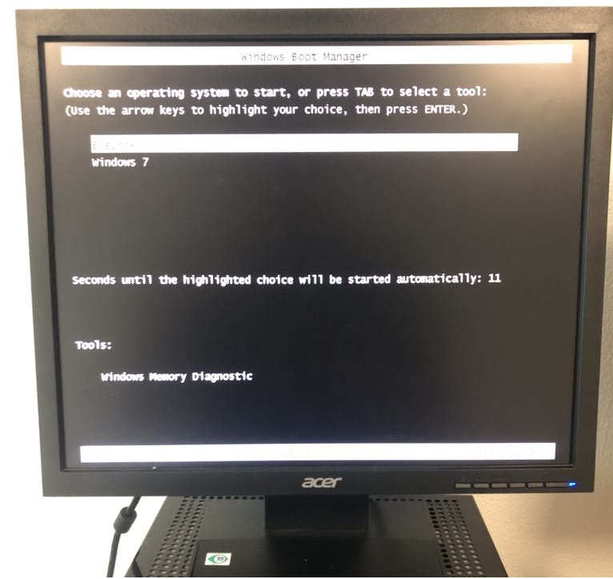
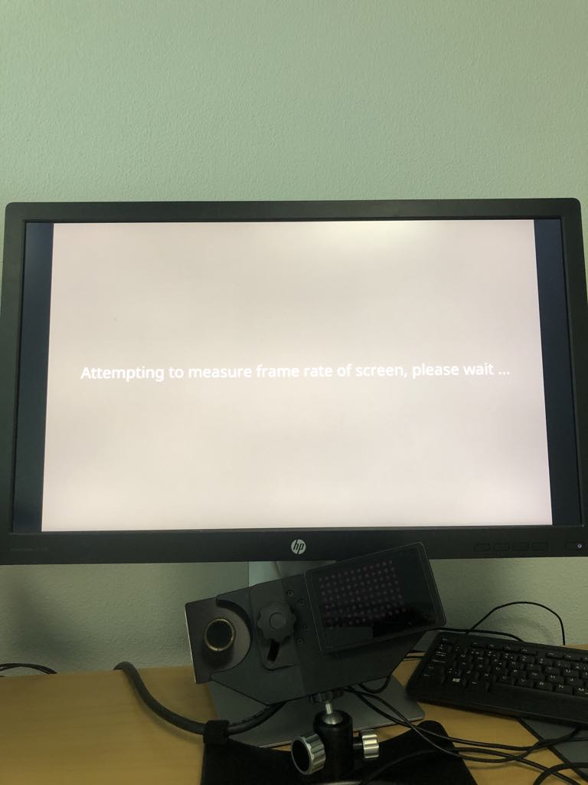
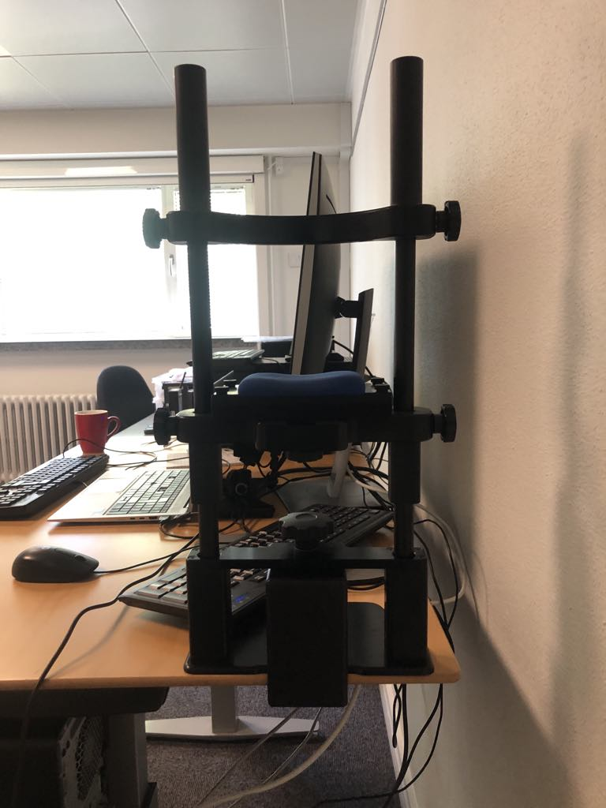
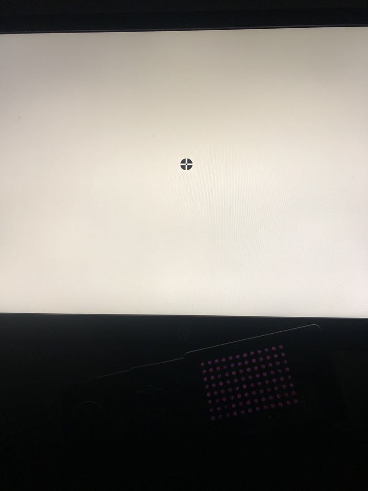
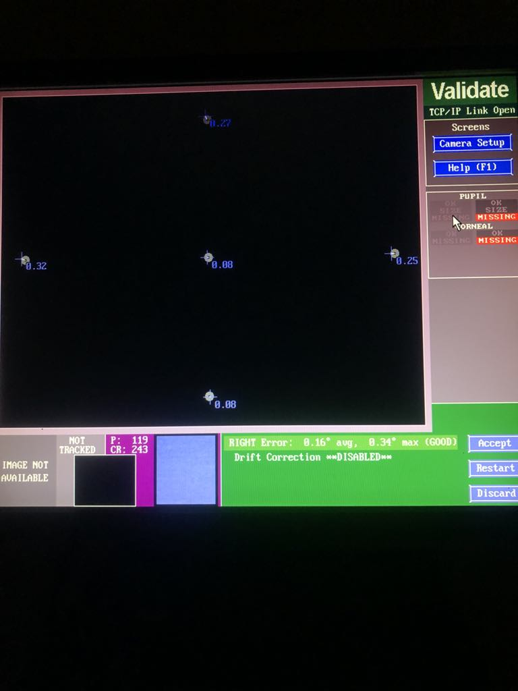
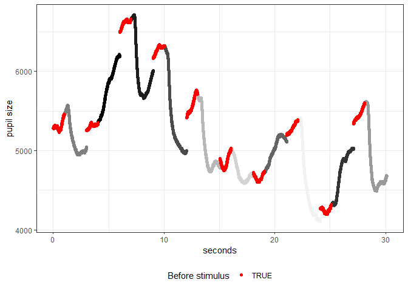
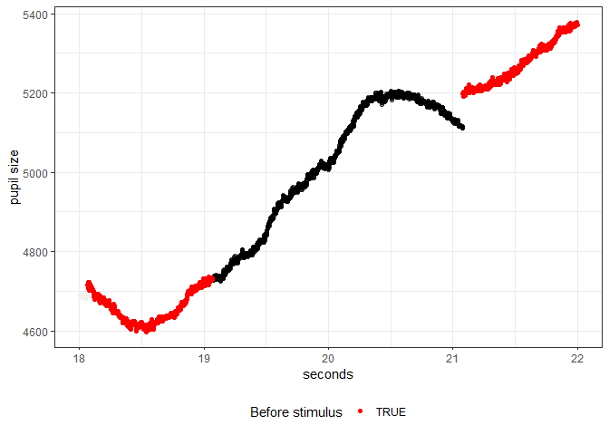
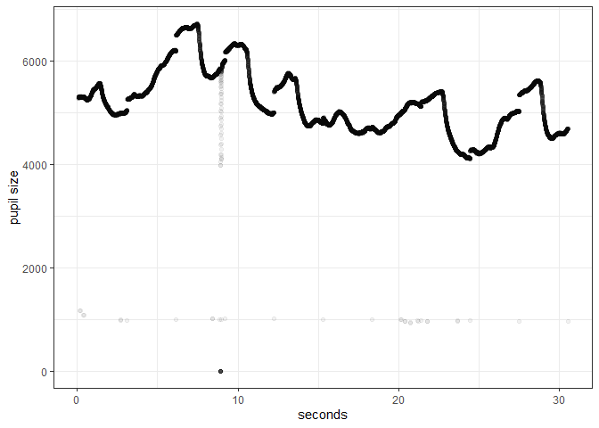
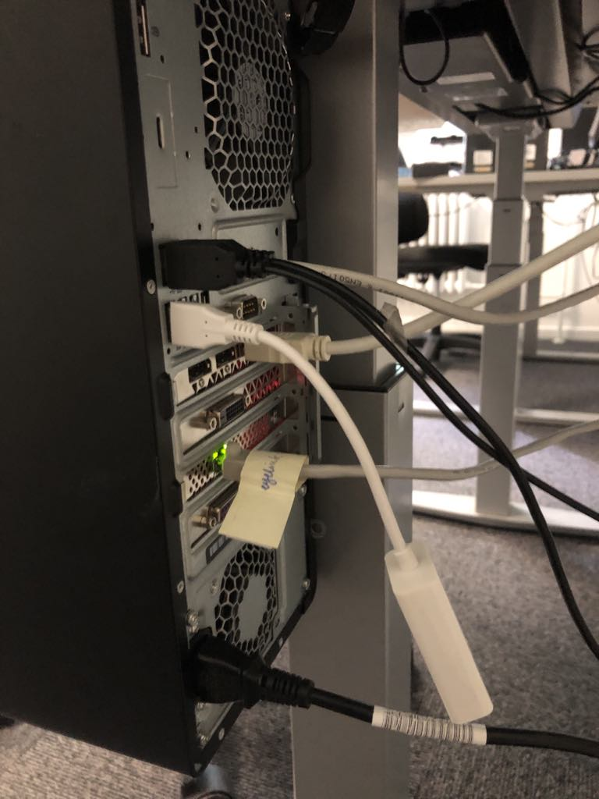
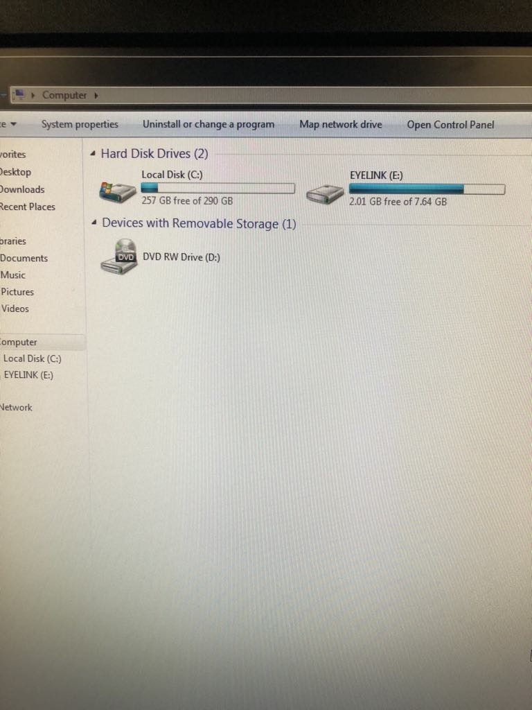

# Eyelink 1000 eye-tracker

This is a quick guide to using the [*Eyelink 1000*](https://www.sr-research.com/eyelink-1000-plus/) eye tracker with an example experiment.

The *Eyelink 1000* is a very precise eye tracke with a sampling rate up to 2000 Hz. The guide includes how to run an example experiment using PsychoPy
and how to assess data quality and visualise data in Python. The eye-tracker also integrates with [*Experiment Builder*](https://www.sr-research.com/experiment-builder/) 
for building experiments and [*Data Viewer*](https://www.sr-research.com/data-viewer/) for data analysis.

## Table of Contents
This guide includes:

1. [How to setup for an experiment](#the-setup)
2. [A guide for running an experiment](#example-experiment)
3. [How to assess data quality and visualise data in Python](#3data-quality-assessment)
4. [FAQ](#4faq)
5. [Data management in COBE Lab](#5data-management)

---

Before continuing please make sure you have successfully run the
*stim_pc_guide*, which you can find [here](../setup/stim_pc_guide.html)

All code for running the experiment script and visualisation of the
data can be found in the associated [github
repository](https://github.com/cobe-lab/cobe-lab.github.io/tree/test) in
the following directory: `cobe-lab.github.io/example code/Eyelink1000`
  
------------------------------------------------------------------------

## The Setup

The Eyelink 1000 eye tracker pc is located just to the left of the
stimulus pc and has its own pc and monitor. Once turned on you can
select to run the Eyelink 1000 or a Windows 7 setup:

<div style="text-align: center;">



</div>

A good pratice is to open the Windows 7 interface to ensure there is
enough space on the pc to store the files obtained by the eye tracker
([see FAQ](#faq)).

Having ensured enough space, restart the eye tracker pc and select the
Eyelink 1000 from the start-up menu. Here you’ll find the interface of
the eye tracker on the eye tracker monitor. Generally interaction with the
eye tracker happens until this point on the eye tracker pc and then
afterwards communication happens through the stimulus pc (if conducting
experiments through psychopy on the stimulus pc).

## Example experiment

As a convenience we have provided a small example experiment using
psychopy in python ([code for
experiment](https://github.com/cobe-lab/cobe-lab.github.io/blob/main/example%20code/Eyelink1000/Eyelink_exp.py)).

This python script imports the eye tracker object that is used to
interact with the eye tracker which is stored in a separate [python
script](https://github.com/cobe-lab/cobe-lab.github.io/blob/main/example%20code/Eyelink1000/EyeLinkCoreGraphicsPsychoPy.py).

### Running the script on the Stimulus PC

As the stimulus pc has the right version of python installed and all
necessary packages, one just needs to run the `Eyelink_exp.py` script.
Running this script should open a new window with the following screen:

<div style="text-align: center;">



</div>

From this screen on the stimulus pc keyboard hit `Enter`. This will move
you into the interface between the eye tracker and the stimulus pc. Now
you should be seeing a blurry square which is what the eye tracker-camera
is capturing.


Now make sure the eye that you want to capture is in the square (use the chin rest for stability). 
Additionally you can click on the Eyetracker computer screen to make the tracker focus on a particular point.

<div style="text-align: center;">



</div>

Now, to calibrate the eye tracker press `c` on the stimulus pc keyboard
which re-directs you to the calibration procedure:

<div style="text-align: center;">



</div>

Now click `Space` for the calibration to start (Make sure you are
looking a the middle of the circle). A new circle will appear in a
different location and when you look at it, it will disappear and a new
appear. When the calibration is finished a grey screen appears.

Now to validate the calibration you should press the `v` key which will
do the exact same procedure. Once finished you will find that the
eyetracking pc will display the accuracy of the calibration.

<div style="text-align: center;">



</div>

Ones the calibration is done you can press `Enter` to again get into the
first interface. When ready you can now proceed to the experiment by
pressing the `o` key. This will continue the experiment script.

Note: In order to not have interfering light in the room while
collecting data it is now a good idea to turn off the monitor of the
eye tracker.

## The Experiment

For this experiment one have to sit and watch the screen while the
Eyelink tracks the pupil and eye. After the experiment is finished a new
directory called `results` should have been created with two files
inside.

The first `Test_subject_1_behavoral_data.csv` should be a small csv file
that has 3 columns `participant`, `trial` and `lumimance`, this is the
trial-wise behavioral data from the experiment.

The second file `EXP.EDF` is the eyetracking data. This type of data is
stored as `.EDF` files, these are binary files that you need to convert
to text files to be able to read them into a programming software. To
make this easy we provide a small R-function that converts these files
which you can find [here](.\example%20code/Eyelink1000/EDF_converter.R).

## Data quality accessment

When piloting your experiment you will have to ensure that the
eye tracker is properly setup and that the quality of the data is in good
shape. One way to do this is by running the script as described below
and then plotting the eye tracker data as a function of time. This is
helpful especially if pupilometry is the main goal as the change in
lumimance should greatly effect the size of the pupil. We show an
example of this below.

### Checking Data quality for Pupilometry.

First we need to convert the eyetracking data from `.EDF` to `.ASC`. we
do this by running the function `convert_edf` from the `EDF_converter.R`
script. This can be done with the following code in R:

``` r
# load libraries
pacman::p_load(tidyverse,here)

# import custom function to covert the EDF file to text
source(here::here("example code","Eyelink1000","EDF_converter.R"))

# Convert the EDF to ASC.
convert_edf(here::here("example code","Eyelink1000","Data"))
```

    Skipping (ASC already exists): C:/Users/au645332/Documents/cobe-lab.github.io/example code/Eyelink1000/Data

Next one can read the eyetracking data.

``` r
asc_lines <- readLines(grep(".asc",
                            list.files(here::here("example code","Eyelink1000","Data"),
                                       full.names = T),
                            value = T))
```

The first lines of this files are meta-data about the eye tracker.

``` r
head(asc_lines,12)
```

     [1] "** CONVERTED FROM C:/Users/au645332/Documents/cobe_dokumentation/Guides/Eyetracker/Eyelink_1000/Data/EXP.EDF using edfapi 4.2.1197.0 Windows   standalone Sep 27 2024 on Wed Jul 23 12:51:59 2025"
     [2] "** DATE: Thu Jul 24 11:01:29 2025"                                                                                                                                                                
     [3] "** TYPE: EDF_FILE BINARY EVENT SAMPLE TAGGED"                                                                                                                                                     
     [4] "** VERSION: EYELINK II 1"                                                                                                                                                                         
     [5] "** SOURCE: EYELINK CL"                                                                                                                                                                            
     [6] "** EYELINK II CL v4.594 Jul  6 2012"                                                                                                                                                              
     [7] "** CAMERA: EyeLink CL Version 1.4 Sensor=BG8"                                                                                                                                                     
     [8] "** SERIAL NUMBER: CL1-ACF16"                                                                                                                                                                      
     [9] "** CAMERA_CONFIG: ACF16140.SCD"                                                                                                                                                                   
    [10] "**"                                                                                                                                                                                               
    [11] ""                                                                                                                                                                                                 
    [12] "MSG\t2057621 DISPLAY_COORDS = 0 0 1919 1199"                                                                                                                                                      

Then there is data about the calibration and validation.

``` r
asc_lines[12:60]
```

     [1] "MSG\t2057621 DISPLAY_COORDS = 0 0 1919 1199"                                                             
     [2] "MSG\t2067938 !CAL "                                                                                      
     [3] ">>>>>>> CALIBRATION (HV5,P-CR) FOR RIGHT: <<<<<<<<<"                                                     
     [4] "MSG\t2067938 !CAL Calibration points:  "                                                                 
     [5] "MSG\t2067938 !CAL -11.5, -40.3         0,    424   "                                                     
     [6] "MSG\t2067938 !CAL -6.7, -57.8         0,  -2583   "                                                      
     [7] "MSG\t2067938 !CAL -16.2, -22.1         0,   3221   "                                                     
     [8] "MSG\t2067938 !CAL -52.0, -45.3     -4046,    424   "                                                     
     [9] "MSG\t2067938 !CAL  28.1, -31.4      4046,    424   "                                                     
    [10] "MSG\t2067938 !CAL eye check box: (L,R,T,B)"                                                              
    [11] "\t  -60    36   -61   -18"                                                                               
    [12] ""                                                                                                        
    [13] "MSG\t2067938 !CAL href cal range: (L,R,T,B)"                                                             
    [14] "\t-6069  6069 -4034  4672"                                                                               
    [15] ""                                                                                                        
    [16] "MSG\t2067938 !CAL Cal coeff:(X=a+bx+cy+dxx+eyy,Y=f+gx+goaly+ixx+jyy)"                                    
    [17] "   5.4838e-05  96.566  25.773 -0.0054514 -0.060796 "                                                     
    [18] "   423.86 -26.733  155.46 -0.17779 -0.47379"                                                             
    [19] ""                                                                                                        
    [20] "MSG\t2067938 !CAL Prenormalize: offx, offy = -11.548 -40.283"                                            
    [21] ""                                                                                                        
    [22] "MSG\t2067939 !CAL Gains: cx:101.261 lx:97.937 rx:107.243"                                                
    [23] "MSG\t2067939 !CAL Gains: cy:118.330 ty:166.243 by:125.273"                                               
    [24] "MSG\t2067939 !CAL Resolution (upd) at screen center: X=2.6, Y=2.2"                                       
    [25] "MSG\t2067939 !CAL Gain Change Proportion: X: 0.095 Y: 0.327"                                             
    [26] "MSG\t2067939 !CAL Gain Ratio (Gy/Gx) = 1.169"                                                            
    [27] "MSG\t2067939 !CAL Cross-Gain Ratios: X=0.267, Y=0.172 "                                                  
    [28] "MSG\t2067939 !CAL PCR gain ratio(x,y) = 2.238, 1.665"                                                    
    [29] "MSG\t2067939 !CAL CR gain match(x,y) = 1.010, 1.010"                                                     
    [30] "MSG\t2067939 !CAL Slip rotation correction OFF"                                                          
    [31] "MSG\t2067941 !CAL CALIBRATION HV5 R RIGHT   GOOD "                                                       
    [32] "MSG\t2073895 !CAL VALIDATION HV5 R RIGHT GOOD ERROR 0.32 avg. 0.43 max  OFFSET 0.26 deg. -4.6,-11.0 pix."
    [33] "MSG\t2073895 VALIDATE R 4POINT 0 RIGHT  at 960,600  OFFSET 0.39 deg.  -2.2,-17.9 pix."                   
    [34] "MSG\t2073895 VALIDATE R 4POINT 1 RIGHT  at 960,102  OFFSET 0.18 deg.  -4.4,7.3 pix."                     
    [35] "MSG\t2073895 VALIDATE R 4POINT 2 RIGHT  at 960,1097  OFFSET 0.11 deg.  0.4,-5.1 pix."                    
    [36] "MSG\t2073895 VALIDATE R 4POINT 3 RIGHT  at 115,600  OFFSET 0.43 deg.  -22.6,-6.8 pix."                   
    [37] "MSG\t2073895 VALIDATE R 4POINT 4 RIGHT  at 1804,600  OFFSET 0.27 deg.  -1.3,-12.2 pix."                  
    [38] "MSG\t2077676 RECCFG CR 1000 2 1 R"                                                                       
    [39] "MSG\t2077676 ELCLCFG MTABLER"                                                                            
    [40] "MSG\t2077676 GAZE_COORDS 0.00 0.00 1919.00 1199.00"                                                      
    [41] "MSG\t2077676 THRESHOLDS R 119 243"                                                                       
    [42] "MSG\t2077676 ELCL_PROC CENTROID (3)"                                                                     
    [43] "MSG\t2077676 ELCL_PCR_PARAM 5 3.0"                                                                       
    [44] "START\t2077677 \tRIGHT\tSAMPLES\tEVENTS"                                                                 
    [45] "PRESCALER\t1"                                                                                            
    [46] "VPRESCALER\t1"                                                                                           
    [47] "PUPIL\tDIAMETER"                                                                                         
    [48] "EVENTS\tGAZE\tRIGHT\tRATE\t1000.00\tTRACKING\tCR\tFILTER\t2"                                             
    [49] "SAMPLES\tGAZE\tRIGHT\tRATE\t1000.00\tTRACKING\tCR\tFILTER\t2"                                            

and lastly data from the actual tracking.

``` r
asc_lines[60:80]
```

     [1] "SAMPLES\tGAZE\tRIGHT\tRATE\t1000.00\tTRACKING\tCR\tFILTER\t2"
     [2] "MSG\t2077677 !MODE RECORD CR 1000 2 1 R"                     
     [3] "2077677\t 1163.7\t  772.9\t 5294.0\t..."                     
     [4] "2077678\t 1163.7\t  773.3\t 5294.0\t..."                     
     [5] "2077679\t 1163.6\t  773.1\t 5289.0\t..."                     
     [6] "2077680\t 1163.4\t  772.9\t 5283.0\t..."                     
     [7] "2077681\t 1162.9\t  772.7\t 5279.0\t..."                     
     [8] "2077682\t 1162.6\t  772.3\t 5282.0\t..."                     
     [9] "2077683\t 1162.6\t  772.3\t 5285.0\t..."                     
    [10] "SFIX R   2077684"                                            
    [11] "2077684\t 1162.9\t  772.5\t 5286.0\t..."                     
    [12] "2077685\t 1162.8\t  772.4\t 5288.0\t..."                     
    [13] "2077686\t 1162.1\t  772.2\t 5290.0\t..."                     
    [14] "2077687\t 1161.3\t  771.7\t 5291.0\t..."                     
    [15] "2077688\t 1160.5\t  771.1\t 5292.0\t..."                     
    [16] "2077689\t 1160.4\t  770.3\t 5292.0\t..."                     
    [17] "2077690\t 1160.5\t  770.5\t 5290.0\t..."                     
    [18] "MSG\t2077691 trialID 1 LUMINANCE 0.6 waiting for 1"          
    [19] "2077691\t 1160.6\t  771.4\t 5283.0\t..."                     
    [20] "2077692\t 1160.6\t  771.9\t 5276.0\t..."                     
    [21] "2077693\t 1160.4\t  771.6\t 5275.0\t..."                     

Each row of these are samples from the eye tracker as the sampling rate
is 1000Hz we get a sample for each ms. The first column is the
timestamp, the second is the x-position of the gaze the third the
y-position of the gaze (these are in screen coordinates) and lastly the
pupil size in arbitrary units.

Please note here the MSG statements particularly
`"MSG\t2077691 trialID 1 LUMINANCE 0.6 waiting for 1"`. This is the
message that was sent to the eye tracker from the python experimental
script i.e:

`tracker.sendMessage(f"trialID {i+1} LUMINANCE {lum} waiting for {Time_before_stim}")`

### Visualizing the data

We have made a crude preprocessing pipeline in order to ensure that the
eye tracker works. Running this produces two plots one before the crude
pre-processing and one after. This also helps to understand what the
different messages in the `.asc` file.

``` r
plots = transform_asc(asc_lines,blink_index = 500,reference_index = 1000, downsample = 1)
```

Lets first look at the preprocessed plot to see that the eye tracker has
worked.

``` r
plots[[1]]
```



Here we see the time by pupil size graph where each of the intervals are
colored of whether it was the 1 second pre-stimulus or the 2 seconds
with stimulus present. Each of the 2 seconds with stimulus present (the
bightness of the screen) is colored in the colour of the screen. As is
clearly visable with brighter stimuli we see a reduction in pupil size
whereas with a decrease in brightness generally increases the pupil
size. This indicates that the eye tracker works for pupilometry.

Secondly one will see that the pre-stimulus and previous stimulus
intervals do not always perfectly overlap. To further reiterate this we
can look at a snippet of the time window:

``` r
plots[[2]]
```



We here see that at 21 seconds there is a jump in pupil size from one
trial to the next. This happens because we are not continuously
recording the pupil size (and gaze) we only record in a section before
the stimulus (1 second here) and then for the duration of the stimulus
(2 seconds here). This means that the interval around 21 seconds in the
plot above was not continuously recorded and there might be several
seconds between the black and red line when the experiment is running.
The reason for doing this is to reduce the space required to store the
eyetracking files as we get 1000 rows per second (sampling rate of
1000Hz) which can quickly add up in memory.

Lastly we might look at the data before it was preprocessed to get a
sense for the raw data:

``` r
plots[[3]]
```



Here we see some quite reasonable raw pupilometry data. What one should
here focus on are the dots where the pupil size is around 1000 which is
scattered in time. These are points where there the eye is partly closed
and the eye tracker can’t find the eye.

The big dip just before 10 seconds is a blink. This can be seen as the
trace of the pupil sharply goes down and a lot of points are situated
where the pupil is 0.

## FAQ

### The eye tracker and the stimulus pc do not communicate.

Please check the cable running from the eye tracker pc to the stimulus
pc:

<div style="text-align: center;">



</div>

### The eye tracker and stimulus do comunicate, but nothing is saved and or the script crashes.

Please check the memory of the eyetracking pc

<div style="text-align: center;">



</div>

## Data management
Remember to transfer the data to your personal AU-computer and store it correctly. You should never store data on COBE Lab's computers due to risk of data theft and data breach. 
We routinely delete data stored on our equipment, so you are at risk of loosing your data, if you store them on our equipment.

