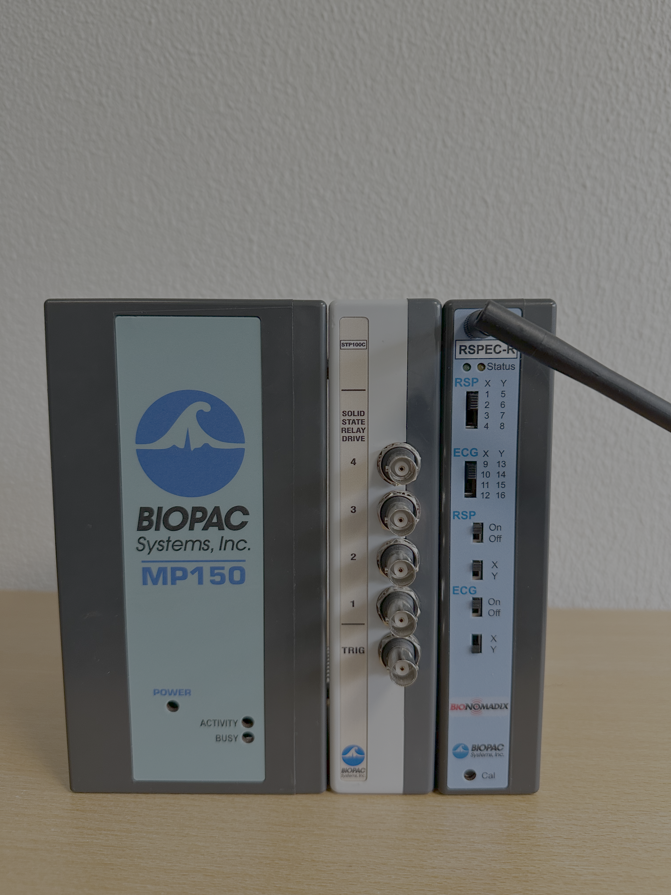

# BIOPAC System

This is a quick guide for COBE Lab’s [*BIOPAC System*](https://www.biopac.com/) which is used to
collect various physiological signals.

BIOPAC equipment allows researchers you to collect and analyse
physiological data from life science experiments. COBE Lab has invested
in a lot of equipment, including wireless options, that allow the
researcher to measure variables relating to skeletal muscle activity,
skin conductance, and cardiovascular measures.

**This guide includes:** 

1. A list of the lab's BIOPAC equipment and software
2. How to setup for an experiment
3. How to run an example experiment
4. Data management in COBE Lab

BIOPAC equipment is simple to set up. Central to the system is the MP150 data acquisition module.
A researcher then adds separate amplifier modules, transducers and
electrodes, depending on what one wishes to measure. The acquisition and
analysis software *AcqKnowledge* is then used to observe, process and analyse
data.

For this guide we will look at how we
can collect *Electrocardiogram*, *Respiration* and also *Electrodermal*
signals. We will do this following the same task as showed in the
[Eyelink 1000
guide](.\Guides/Eyetracker/Eyelink_1000/Eyelink_guide.html), where a
participant is watching a series of different lumaniance on the computer
screen. Firstly we will introduce you to the different hardware and software you’ll
need.

## BIOPAC hardware and software

**The lab’s BIOPAC equipment includes:**

- Two MP150 systems: Basic data acquisition package including the
  Universal Interface Model (UIM100C).

- 9 AcqKnowledge software license for Windows

- Three PPGED modules: Wireless BioNomadix module—matched transmitter
  and receiver designed to measure Blood Volume Pulse (BVP) and
  Electro-Dermal Activity (EDA). EDA is also known as galvanic skin
  response and skin conductance activity).
  [(spec)](https://www.biopac.com/product/bionomadix-ppg-and-eda-amplifier/).

- Two RSPEC modules: Wireless electrocardiography (ECG) and respiration
  amplifier—matched transmitter and receiver designed to collect
  respiration and electrocardiogram data. The system can record both
  simultaneously, and can record at a rate of 2000 Hz. Two channels are
  integrated: Channel A can measure abdominal and thoracic expansion and
  contraction during breathing, whilst Channel B can record electrical
  activity generated by the heart via attached electrodes.
  [(spec)](https://www.biopac.com/product/bionomadix-rsp-with-ecg-amplifier/)

- Six EMG100C modules: Electromyogram (EMG) amplifier—amplifies general
  and skeletal muscle electrical
  activity.[(spec)](https://www.biopac.com/product/electromyogram-amplifier/)

- One ECG100C module: Electrocardiogram (ECG) amplifier—reliably records
  electrical activity generated by the heart.
  [(spec)](https://www.biopac.com/product/ecg-electrocardiogram-amplifier/)

- One GSR-100C module: wired Galvanic Skin Response (aka Electro-Dermal
  Activity) unit

- Two STP100C module: Isolated digital interface.
  [(spec)](https://www.biopac.com/product/isolated-digital-interfaces/?attribute_pa_size=isolated-digital-interface-with-printer-port-interface)

- Various electrodes.

**MP150:** The MP150 is the main box that modules are connected to.

**Modules:** The modules are the receivers of the wearable devices that the subjects
wear in order to collect the physiological signals. There are several of
these that connect to the different wearable devices. In order to know
which are connected to which please see …

**Trigger device:** In order to ensure temporal control it will many times be necessary to send signals to the software that collects and stores the
physiological data. These signals can be sent using a the …. which
connects to the …. and the …. which can then be programmed to send small
voltage difference at stimulus onset. This essentially gives you another
variable that tells you when signals were sent, which is particularly
important in event related designs.

**AcqKnowledge:** COBE Lab has access to BIOPAC's [*AcqKnowledge
software*](https://www.biopac.com/product/acqknowledge-software/), which
makes it easy to store, transform, analyse and in general interact with
the data from the BIOPAC devices.

## The setup

In general the setup follows the structure of:

- Setting up the hardware and their connections.
- Ensuring connection from wearable devices and AcqKnowledge.
- Ensuring reliable triggers from the experimental script to AcqKnowledge.

**Setting up the hardware and their connections**

First one needs to connect the MP150 to both the … and the … after this
the … nessecary for your experiment are connected to it. Here we use
*ECG*, *RRSP* and also *EDA* modules and wearable devices. Together the
MP150 should look something like below:

Now that all the hardware is connected one needs to open the
AcqKnowledge software. To use the software you need one of the AcqKnowledge keys. 
When opened you should navigate to …. and then …. in order to select the
appropriate outputs from the wearable devices. If properly selected,
both the wearable devices but also the configurations in AcqKnowledge
you will see that the modules connected to the MP150 will light green.
Now you can select start recording in order to see if a signal goes
through, here it is very convenient to have an easily manipulated signal
(such as the respiration) to see that a change in the physical device
also makes a change in the Acqknowledge software.

When all of this works and is setup we connect the trigger box to … and
….. If connected properly one should see ….

## The experiment

Now when everything is running properly we can run the experiment. The
code for this is stored in

All code for running the experimental script and visualization of the
data can be found in `~/Guides/Biopac/Code`. The experimental code is
the same as for the code presented in the [stim PC
guide](.\guides/setup/stim_pc_guide.md) with the only differences being
related to BIOPAC.

## Data management
Remember to transfer the data to your personal AU-computer and store it correctly. 
You should never store data on COBE Lab's computers due to risk of data theft and data breach. 
We routinely delete data stored on our equipment, so you are at risk of loosing your data, if you store them on our equipment.
